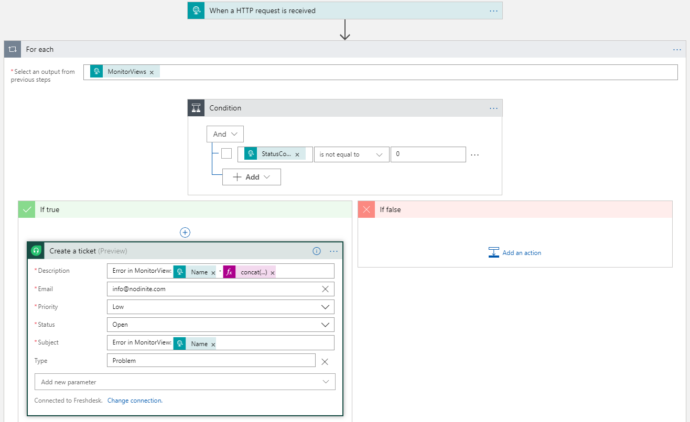
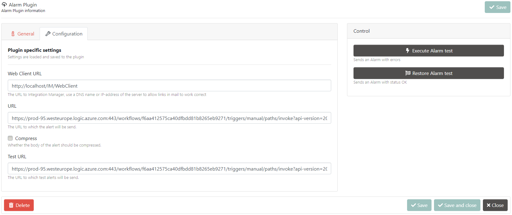
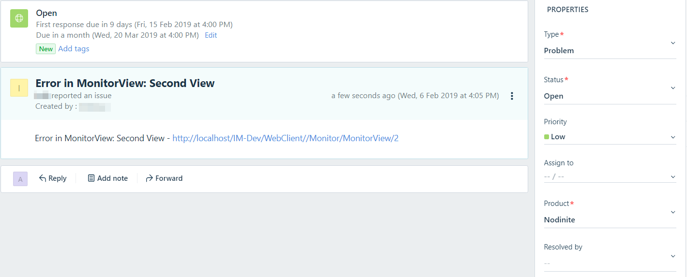

# Nodinite - Webhook - Logic App FreshDesk Template

Ever wanted to integrate [Nodinite](https://nodinite.com/) with [Freshdesk](https://freshdesk.com/) or any other customer support software? Using [Nodinite's](https://nodinite.com) HTTP WebHook plugin and a Logic App it is possible. 

This repository contains a simple Logic App template to get you started, which receives an HTTP call from [Nodinite](https://nodinite.com) and uses Azure's built-in connector for [FreshDesk](https://freshdesk.com/).

## Requirements

For this to work you need to have:

1. A running instance of [Nodinite](https://nodinite.com)
2. The HTTP Webhook plugin for Alarms (For this template to work, __**do not enable**__ the **Compress Body** flag in the plugin configuration)
3. A working instance of [FreshDesk](https://freshdesk.com)
4. Your FreshDesk API key

## Installation

Press the "Deploy to Azure" button and fill in your Azure information, the name of the resource group and a name for the Logic App. The deployment will automatically create the resources in your Azure tenant and subscription.

The only thing not provided in this deployment file is the connection information to your [FreshDesk](https://freshdesk.com) instance. This is a manual step you are required to do in the Azure Logic Apps designer.

## How it works

The Logic app will be configured to retrieve data from Nodinite (the JSON schema is automatically provided) and loops over all Monitor Views that have a changed state. The Logic App will automatically create new tickets in your freshdesk for each Monitor View that has a status code that does not match 0 (status code for OK).

Some fields are pre-defined:

* **Subject** - Predefined value: "Error in MonitorView: {Name of the Monitor View}"
* **Description** - Predefined value contains the name and a link to the Monitor View in your [Nodinite](https://nodinite.com) installation.
* **Priority (SLA)** - Predefined value: Low
* **Status** - Predefined value: Open
* **Type** - Predefined value: Problem

Depending on your FreshDesk instance, other fields might need to be configured, e.g. **Product**.

## How do I test this

1. Visit the WebClient of your [Nodinite](https://nodinite.com) installation.
2. Go to Administration, Settings, Alarm Plugins and choose the **HTTP Webhook** plugin.
3. Choose the "Configuration" tab and fill in the URL of your Logic App in the **Test URL** field.
4. Click the **Save** button.
It should basically look like the screenshot below.

5. Click the **Execute Alarm test** button

If you have followed the steps above, a ticket should be created in your [FreshDesk](https://freshdesk.com) instance - as shown below.

